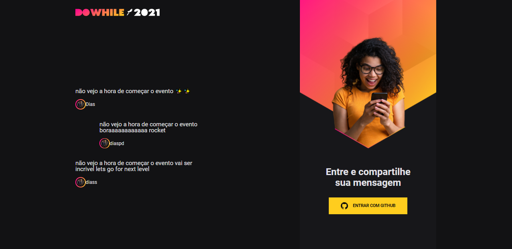

<h1 align="center">
  NLW-Heat
</h1>

<br></br>

<p align="center">
  <a href="#-Technologies">Technologies</a>&nbsp;&nbsp;&nbsp;|&nbsp;&nbsp;&nbsp;
  <a href="#-Project">Project</a>&nbsp;&nbsp;&nbsp;
</p>

<br>

<h1 align="center">
  
</h1>


## 🚀 Getting started

Clone the project and access the folder.

```bash
$ git clone https://github.com/diaspd/Nlw-Heat.git
$ cd 
```

Follow the steps below:
```bash
# Install the dependencies
$ npm i

# Start the project
$ npm start
```
Use the other project on https://github.com/rocketseat-education/nlw-heat-node to run the server and <br> </br>
The app will be available for access on your browser at http://localhost:3000


<br></br>

## 💻 Technologies

This project was developed with the following technologies:

- React


## 📄 Project
💰 A project made for people send messages on this page.

<br></br>


Feito com ♥ by Pedro Dias (😎)<br></br>
https://www.instagram.com/dias_pdr/ <br></br>
https://www.facebook.com/PedroDias24/<br></br>
https://twitter.com/diaspdr_1<br></br>
https://www.twitch.tv/diasgm_pdr<br></br>

Se puder dar uma estrelinha, eu agradeço 🤩
<br></br>
If you can give a little star, I appreciate it 🤩
